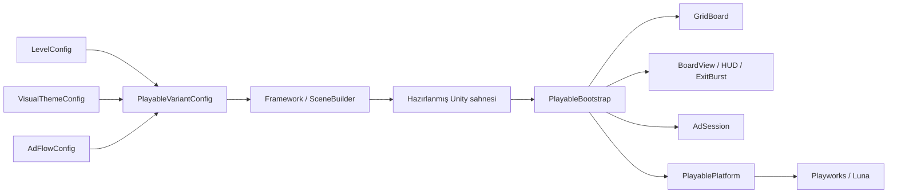

# Color Block Playable Framework

**Unity + Playworks ile, editörde hazırlanan ve farklı kreatiflerde tekrar kullanılabilen bir color block puzzle playable altyapısı.**

Color Block Jam’in renk eşleştirme ve blok çıkarma hissinden yola çıkan bağımsız bir portföy çalışması. Amaç yalnızca tek bir reklam sahnesi üretmek değil; level, tema ve reklam akışını değiştirerek aynı araçtan yeni playable varyantları hazırlamak.

Öncelik sırası: **düşük runtime maliyeti → küçük build → kolay varyant üretimi → temiz, anlaşılır kod.**

<p align="center">
  
</p>

<p align="center"><em>80 blok, 8 renk ve 8 çıkış. Bu görsel Unity’de alınan responsive yerleşim önizlemesidir.</em></p>

| | Kullanılan yapı |
| --- | --- |
| Unity | `6000.0.72f1` |
| Playworks / Luna SDK | `7.2.0` |
| Oynanış | Grid üzerinde blok sürükleme ve aynı renkli çıkıştan çıkarma |
| Görsel yöntem | Ortografik kamera, düz mesh’ler ve vertex renkleriyle hacim hissi |
| İçerik hazırlama | ScriptableObject config’leri → editör aracı → hazır Unity sahnesi |
| Güncel yoğun varyant | 16 × 20 grid, 80 adet dört hücreli blok |
| Runtime efekt | Önceden hazırlanmış 12 mesh parçası; fizik simülasyonu yok |
| Runtime bağımlılık yaklaşımı | Doğrudan referanslar; DI container ve tween kütüphanesi kullanılmıyor |

## İçindekiler

- [Projenin kapsamı](#projenin-kapsamı)
- [Kurulum ve ilk çalıştırma](#kurulum-ve-ilk-çalıştırma)
- [Level ve varyant tasarlama](#level-ve-varyant-tasarlama)
- [Mimari](#mimari)
- [3D gibi görünen hafif görseller](#3d-gibi-görünen-hafif-görseller)
- [Oynanış ve reklam akışı](#oynanış-ve-reklam-akışı)
- [Responsive UI ve çentik desteği](#responsive-ui-ve-çentik-desteği)
- [Optimizasyon kararları](#optimizasyon-kararları)
- [Performans ve build boyutu](#performans-ve-build-boyutu)
- [Doğrulama ve testler](#doğrulama-ve-testler)
- [Yeni özellik ekleme](#yeni-özellik-ekleme)
- [Klasör yapısı ve sorun giderme](#klasör-yapısı-ve-sorun-giderme)

## Projenin kapsamı

Altyapı; çok hücreli blokları, farklı şekilleri, engelleri, pasif hücreleri, dört kenardaki renkli çıkışları ve hareket kısıtlarını destekler. Aynı oyun modeli farklı level düzenleriyle kullanılabilir.

Mevcut içerik katmanları:

| Config | Sorumluluk |
| --- | --- |
| `LevelConfig` | Grid boyutu, hücre istisnaları, bloklar ve çıkışlar |
| `VisualThemeConfig` | Palet, board/duvar rengi, aralıklar, köşe yarıçapı, çıkıntılar ve ortak materyal |
| `AdFlowConfig` | CTA davranışı, metinler, tutorial, bitiş koşulları ve etkileşim süresi |
| `PlayableVariantConfig` | Bu üç config’in birleşimi; hareket ve çıkış animasyonu süreleri |

Hazır varyantlar:

| Varyant | Kullanım |
| --- | --- |
| `Variant_A` / `Variant_B` | Starter level üzerinden farklı reklam akışlarını denemek |
| `Variant_Showcase` | 8 × 10 grid üzerinde 20 blok ve 4 alt çıkış |
| `Variant_Stress` | 16 × 20 grid üzerinde 80 blok, 8 renk ve 8 alt çıkış |

Güncel hazırlanmış sahne `Variant_Stress` kullanır. Daha küçük showcase varyantı korunur. Bunlar runtime’da sırayla yüklenen level’lar değildir; build öncesinde bir varyant seçilip sahne hazırlanır.

## Kurulum ve ilk çalıştırma

1. Projeyi Unity **6000.0.72f1** ile aç.
2. Playworks **7.2.0** SDK paketini indir ve kalıcı bir klasöre çıkar. SDK proje dışında tutulur.
3. Unity’de **Tools → Color Block → Framework** penceresini aç.
4. **Connect Playworks SDK…** ile SDK içindeki **`scripts/package.json`** dosyasını seç. SDK kökünde `pipeline` ve `tools` klasörleri de bulunmalıdır.
5. Paket çözümlemesi ve derleme tamamlandıktan sonra Playworks hesabına kendi kurulumunda giriş yap.
6. Framework penceresinde **Active Variant** alanından bir varyant seç.
7. **Validate variant**, ardından **Prepare playable scene** düğmesine bas.
8. Hazırlanan `Assets/_Project/Scenes/Playable_2D.unity` sahnesini açıp Play Mode’da dene.

SDK bağlanınca editör kodu `PLAYWORKS_SDK` tanımını senkronize eder. SDK olmadan Unity içi önizleme yapılabilir; mağaza yönlendirmesi önizlemede bir log ile temsil edilir. Playworks release akışı SDK gerektirir.

SDK klasörünü taşırsan bağlantıyı yeniden kur. Proje başka makinede açıldığında eski bilgisayara ait yerel SDK yolu geçerli olmayabilir.

## Level ve varyant tasarlama

### Framework penceresi

**Tools → Color Block → Framework** tek hazırlama ekranıdır.

| Bölüm / işlem | Ne yapar? |
| --- | --- |
| **Active Variant** | Düzenlenecek ve sahneye hazırlanacak varyantı seçer |
| **Selected Block** | Grid’de hangi bloğun konumunun değişeceğini belirler |
| Grid üzerinde tıklama / sürükleme | Seçili bloğun origin konumunu değiştirir |
| **Shift + tık** | Hücrede engel istisnasını ekler veya mevcut istisnayı kaldırır |
| **Level / shapes / gates** | Blok listesi, şekil hücreleri, renkler ve çıkışları Inspector üzerinden düzenler |
| **Theme / palette** | Görsel parametreleri düzenler |
| **Ad flow** | Reklam davranışını ve metinlerini düzenler |
| **Validate variant** | İçeriğin yapısal olarak geçerli olup olmadığını kontrol eder |
| **Prepare playable scene** | Seçili içerikten kamera, HUD, board, blok ve efekt objelerini editörde hazırlar |

Mevcut araç temel bir grid editörü ve birleşik Inspector’dır. Blok/çıkış eklemek veya bir şeklin hücrelerini çizmek için hâlâ listeler düzenlenir; tam bir boyama aracı ya da otomatik puzzle üreticisi değildir. Grid önizlemesi oynanış simülasyonu yapmaz.

### Yeni bir level oluşturma

1. Project penceresinde **Create → Playable → Data → Level Config** ile bir level oluştur. İstersen `Level_Starter` veya `Level_Showcase` asset’ini çoğalt.
2. **Create → Playable → Data → Variant Config** ile yeni varyant oluştur veya mevcut bir varyantı çoğalt.
3. Varyantın `levelConfig` alanına yeni level’ı bağla. Bir tema ve reklam akışı ata.
4. `variantId` için anlamlı bir isim ver.
5. Grid boyutunu, blokları ve çıkışları düzenle.
6. Framework’te bu varyantı seç, doğrula ve sahneyi hazırla.

**Bir varyantı çoğaltmak bağlı config’leri çoğaltmaz.** İki varyant aynı theme veya flow asset’ini kullanıyorsa o asset’teki değişiklik ikisini de etkiler. Bağımsız bir kreatif istiyorsan ilgili config’leri de çoğaltıp yeniden bağla.

### Koordinatlar ve blok şekilleri

Grid’in sol alt hücresi `(0, 0)`’dır. X sağa, Y yukarı artar. Board boyutları 1–64 hücre aralığında olabilir; bu veri sınırı her büyüklükte board’un mobilde aynı performansı vereceği anlamına gelmez.

Bir blok iki parçayla tanımlanır:

- **`origin`:** Şeklin board üzerindeki başlangıç koordinatı.
- **`localCells`:** Origin’e göre şeklin kapladığı hücreler.

Örnek bir 2 × 2 blok:

```text
id: red_square
colorId: Red
origin: (0, 0)
localCells: [(0, 0), (1, 0), (0, 1), (1, 1)]
movementMode: Free
```

Bir L şekli için örneğin `[(0, 0), (1, 0), (0, 1)]` kullanılabilir. Şeklin hücreleri birbirine bağlı olmalı ve tekrar etmemelidir. Bloklar üst üste gelemez, board dışına veya engel/pasif hücre üzerine yerleşemez.

`cells` listesi boşsa board’un tamamı aktif kabul edilir. Liste, tüm zemini tek tek tanımlamak yerine yalnızca istisnaları tutar: `isBlocker` ile engel, `isActive = false` ile pasif hücre.

Hareket seçenekleri: `Free`, `HorizontalOnly`, `VerticalOnly`, `UpOnly`, `DownOnly`, `LeftOnly`, `RightOnly`, `Locked`. Serbest bloklar da grid üzerinde yatay/dikey adımlarla ilerler; çapraz bir hücre adımı uygulanmaz.

### Çıkışlar

Her çıkışın benzersiz bir `id`, bir `colorId`, bir `side`, bir `startIndex` ve bir `length` değeri vardır.

| Kenar | `startIndex` hangi eksende? |
| --- | --- |
| `Top` / `Bottom` | Soldan sağa X koordinatı |
| `Left` / `Right` | Alttan üste Y koordinatı |

Örnekteki kırmızı 2 × 2 blok için alt çıkış: `side = Bottom`, `startIndex = 0`, `length = 2`, `colorId = Red`.

Bloğun rengi çıkışla eşleşmeli ve şeklin tamamı **tek bir çıkışın** açıklığına sığmalıdır. Komşu iki çıkış, tek bir geniş çıkış gibi davranmaz. Çıkışlar aynı kenarda çakışamaz.

Blok ve çıkış renkleri sekiz oynanış renginden seçilir. `Slate` ve `Navy`, board/çerçeve gibi yüzeyler için ek palet kimlikleridir; blok veya çıkış rengi olarak kullanılmaz.

### Sahneyi hazırlama

`Prepare playable scene`, runtime’da üretilecek işi editöre taşır:

1. Config’leri doğrular.
2. Board, duvarlar ve çıkışları tek mesh’e hazırlar.
3. Blok şekilleri için kalıcı, paylaşılabilir mesh asset’leri oluşturur veya önbellekten kullanır.
4. Blok Transform’larını ve renk referanslarını kurar.
5. Kamera, HUD, seçim görünümü, arka plan ve parçalanma havuzunu hazırlar.
6. Sahneyi kaydeder ve build sahnesi olarak seçer.

Araç kendi ürettiği içerikleri yeniler; bootstrap altına elle eklenen bağımsız objeleri korumak için rebuild kontrolü bulunur. Üretilen board/HUD’un içini elle değiştirmek yerine ilgili config veya builder’ı düzenlemek gerekir; bu bölümler yeniden hazırlamada değiştirilir.

**Level, blok şekli, tema veya aktif varyant değiştiğinde sahneyi tekrar hazırla.** Yalnızca SO’yu değiştirmek, daha önce hazırlanmış mesh ve objeleri otomatik güncellemez.

Validator geometrik/verisel hataları yakalar; her özel level’ın çözülebilirliğini kanıtlayan genel bir solver değildir. 80 blokluk hazır bölümün çözülebilirliği ayrıca test edilmiştir.

## Mimari



| Sınıf | Görev ve tercih nedeni |
| --- | --- |
| [`GridBoard`](Assets/_Project/Scripts/Runtime/Core/GridBoard.cs) | Doluluk, şekiller, hareket ve çıkış kuralları. MonoBehaviour veya fizik bağımlılığı olmadan test edilebilir |
| [`PlayableBootstrap`](Assets/_Project/Scripts/Runtime/PlayableBootstrap.cs) | Input, hareket, efekt, tutorial, reklam akışı ve kamera için tek koordinasyon noktası |
| [`BoardView`](Assets/_Project/Scripts/Runtime/View/BoardView.cs) | Hazır Transform’lar, renkler, hareket kuyruğu ve seçim görünümü |
| [`ExitBurst`](Assets/_Project/Scripts/Runtime/View/ExitBurst.cs) | Önceden hazırlanmış parçaların konum/dönüş/boyut animasyonu |
| [`PlayableHud`](Assets/_Project/Scripts/Runtime/View/PlayableHud.cs) | Metinler, CTA, responsive alan ve hafif UI animasyonları |
| [`AdSession`](Assets/_Project/Scripts/Runtime/Flow/AdSession.cs) | Hamleler, bitiş koşulları ve aktif etkileşim süresi |
| [`PlayablePlatform`](Assets/_Project/Scripts/Runtime/Platform/PlayablePlatform.cs) | Analytics, pause/resume ve mağaza çağrılarının tek SDK sınırı |
| [`PlayableSceneBuilder`](Assets/_Project/Scripts/Editor/PlayableSceneBuilder.cs) | Config’lerden kaydedilmiş sahne hazırlama |
| [`FlatMeshBuilder`](Assets/_Project/Scripts/Editor/FlatMeshBuilder.cs) | Görsel geometriyi editörde üretme ve sıkıştırma |

### Model ile görünüm neden ayrı?

`GridBoard` kaynak SO verisini başlangıçta kopyalar. Oyuncu bir bloğu hareket ettirdiğinde config asset’i değişmez. `PreviewStep` bir hareketi uygulamadan sorgular; ipucu sistemi aynı kuralları kullanır.

Bir hareket geçersizse doluluk tablosu değişmez. Geçerliyse model önce yeni hücreleri doğrular, sonra eski/yeni doluluğu günceller. Görünüm bu sonucu animasyonla takip eder. Böylece görsel yumuşatma oynanışın doğruluğunu belirlemez.

### Neden Zenject veya büyük bir framework yok?

Bu kapsamda bağımlılıklar az ve açık: sahnedeki hazır referanslar ile küçük birkaç runtime sınıfı yeterli. DI container, genel event bus veya her obje için controller katmanı eklemek mevcut probleme gerekli bir çözüm getirmiyordu. Genişletilebilirlik; config sınırları, model/view ayrımı ve SDK adaptörü üzerinden sağlanır.

## 3D gibi görünen hafif görseller

Board ve bloklar `MeshRenderer` kullanır; görünüm **ortografik kamera önündeki düz geometri** ile oluşturulur. Küçük Z farkları katman sırasını belirler. Hacim hissinin büyük kısmı renge ve siluete gömülüdür.

| Görünen detay | Nasıl oluşturuluyor? |
| --- | --- |
| Yuvarlatılmış blok köşeleri | Mesh’in köşe geometrisi |
| Kalın blok kenarları | Açık üst kenar, koyu yan/alt yüzey renkleri |
| Dairesel çıkıntılar | Birkaç renkli disk katmanı |
| Kalın board duvarları | Ton farkları ve alt yüzey geometrisi |
| Ayrı dış köşeler | Kenarlardan ayrılan yuvarlatılmış köşe parçaları |
| Zemin hissi | Koyu board tabanı üzerindeki hafif aralıklı hücre yüzeyleri |
| Beyaz seçim vurgusu | Seçili şeklin aynı mesh’ini kullanan, biraz büyütülmüş ikinci renderer |
| Hafif yükselme | Seçili bloğun ölçeğinin yumuşakça büyümesi |

Bu yüzeylerin görünümü için büyük blok/zemin PNG’leri, gerçek zamanlı ışıklar, gölge haritaları veya fizik objeleri gerekmiyor. UI fontları ayrı olarak atlas kullanır; “texturesiz board” tüm uygulamada hiç texture olmadığı anlamına gelmez.

### Renkler ve ortak şekiller

Blok şekilleri beyaz tabanlı gölgelendirmeyle hazırlanır. Palet rengi renderer üzerinden uygulanır. Aynı şekil ve tema geometrisini kullanan farklı renkli bloklar aynı mesh asset’ini paylaşır.

`ColorId` ile blok, çıkış, board ve çerçeve için anlamlı palet kimlikleri seçilir. Paletteki gerçek tonlar `VisualThemeConfig` üzerinden yönetilir; board ve çerçeve ayrı enum seçimleriyle ayarlanır.

Playworks ile Unity’nin renk dönüşümünde fark görüldüğü için blok tint’i açıkça uygun renk uzayına çevrilip `SetVector("_Color", ...)` ile gönderilir. Farklı renkteki bloklar için aynı `MaterialPropertyBlock` değiştirilerek tekrar kullanılmaz: SDK referansı koruduğunda tüm blokların son renge dönüşmesi önlenir.

Ortak mesh ve materyal, bütün sahnenin tek draw call olduğu anlamına gelmez. Renk override’ları, UI ve batching sınırları gerçek çizim sayısını etkiler.

### Hareketli arka plan

[`MovingWater.shader`](Assets/_Project/Shaders/MovingWater.shader), `_Time` üzerinden hafif bir dalga deseni üretir. 91 vertex / 144 üçgenden oluşan küçük bir mesh kullanır. Dalga hesabı vertex aşamasındadır; fragment aşaması gelen rengi döndürür.

Arka plan için video, büyük texture animasyonu veya C# tarafında her kare mesh üretimi kullanılmaz. Bu tercih indirme boyutunu küçük tutar; yine de tam ekran çizimin ekran çözünürlüğüne bağlı bir GPU maliyeti vardır.

### UI ve parçalanma

CTA arka planı [`RoundedButtonGraphic`](Assets/_Project/Scripts/Runtime/View/RoundedButtonGraphic.cs) ile çizilir: yuvarlatılmış yüz, koyu kenar ve alt gölge. UI mesh’i 51 vertex / 48 üçgendir. Büyük bir buton PNG’si yerine renklenebilir geometri kullanılır.

CTA ve tutorial’da **Lilita One**, başlık ve yardımcı metinlerde Unity’nin **LegacyRuntime** fontu kullanılır. Lilita metinler beyaz yazı ve koyu outline ile hazırlanır. CTA’nın küçük scale döngüsü ve metin girişleri basit zaman/lerp işlemleridir; tween paketi gerekmez.

Çıkış efekti bir `ParticleSystem` değildir. **12 hazır mesh parçası** ortak küçük şekli kullanır; konum, dönüş ve ölçekleri tek sınıftan ilerletilir. Objeler hazır durur, renderer’lar yalnızca efekt sırasında açılır. Güncel çıkış süresinde efekt yaklaşık 0,6 saniye sürer.

<p align="center">
  
</p>

<p align="center"><em>Parçalanma efektinin Unity görünürlük kontrolü. Ek fizik veya runtime obje üretimi kullanılmaz.</em></p>

## Oynanış ve reklam akışı

Güncel showcase/stress akışı:

1. Hook, board ve CTA gösterilir.
2. Tutorial, config’teki kısa gecikmeden sonra açılır.
3. Oyuncu bloğu tutup sürükler. Model hücre adımlarını doğrular; görünüm konumu yumuşatır.
4. Aynı renkli çıkıştan çıkan blok gizlenir ve hazır parçalanma efekti oynar.
5. Oyuncu bir süre beklerse, geçerli bir adım yapabilen blok kısa süreli vurgulanır.
6. CTA başlangıçtan itibaren mağaza çağrısını yapabilir.
7. **Toplam 10 saniye aktif blok etkileşiminden sonra**, sonraki yeni ekran dokunuşu da mağaza çağrısını yapar.

Aktif etkileşim, geçerli bir bloğun tutulduğu/sürüklendiği süredir; her kare yeni bir hücreye ilerleme zorunluluğu yoktur. Boş yere basmak, beklemek ve pause süresi bu sayaç yerine geçmez. Eşik dolduğu anda otomatik yönlendirme yapılmaz; sonraki pointer-down beklenir.

Güncel flow `Manual` kullanır: ekranda zorunlu bir skor/hamle hedefi veya otomatik kazanma end card’ı gösterilmez. Altyapıda ayrıca tüm bloklar, hedef blok sayısı, süre ve hamle sınırı üzerinden bitiş seçenekleri bulunur.

### Analytics ve Playworks alanları

SDK çağrıları yalnızca `PlayablePlatform` içinde toplanır.

| Olay | Tetiklenme koşulu |
| --- | --- |
| `TutorialStarted` | Tutorial açık config ile oturum başlarken |
| `FirstMoveCompleted` | İlk geçerli hareket içeren sürükleme bırakıldığında |
| `CtaClicked` | CTA veya etkileşim eşiği sonrası mağaza dokunuşunda |
| `PlayerWon` / `PlayerLost` | Bir bitiş koşulu üzerinden oturum tamamlandığında |
| SDK level/end card olayları | İlgili bitiş/end card akışı kullanıldığında |

Manuel showcase akışında win/lose olaylarının kendiliğinden oluşması beklenmez. Event sayısı, oyuncunun girdiği akışa bağlıdır.

`LunaPlaygroundField` üzerinden aktif etkileşim süresi, hook, tutorial, CTA ve end card başlığı değiştirilebilir. Bunlar yeni level geometrisi üretmez. Yeni bir metin/dil varyantında font atlasının gereken karakterleri içerdiği ayrıca kontrol edilmelidir.

## Responsive UI ve çentik desteği

Canvas `1080 × 1920` referans çözünürlükle ölçeklenir. Beyaz başlık arka planı ekranın üstüne sıfır bağlanır; metin korunan içerik alanında kalır. CTA korunan alt kenara sabitlenir. Kamera da aynı alanın boyutlarını kullanır.

**SDK’ye özel bulgu:** Playworks 7.2.0’ın üretilen JavaScript motorunda `Screen.safeArea`, çentiği çıkarmadan tüm viewport’u döndürür. Bu yüzden yalnızca Unity’nin safe-area sonucuna güvenmek, cihaz çerçevesi önizlemesinde başlığın kesilmesine neden olmuştu.

`PlayableHud.GetSafeArea`, bildirilen alanı aşağıdaki minimum yerleşim paylarıyla kesiştirir:

| Yön | Üst | Yanlar | Alt |
| --- | ---: | ---: | ---: |
| Dikey | %6,5 | %2 | %4 |
| Yatay | %2 | %6 | %4 |

Cihaz daha büyük bir güvenli alan bildirirse daha büyük pay korunur. Bu bir donanım çentik algılama sistemi değildir; SDK’nin bilgi vermediği duruma karşı responsive bir yerleşim payıdır. Hesap başlangıçta ve ekran/safe-area değişiminde yapılır.

<p align="center">
  
</p>

<p align="center"><em>Yatay yerleşim simülasyonu. Gerçek cihaz testinin yerine geçmez.</em></p>

## Optimizasyon kararları

| Karar | Neden? | Sınırı / karşılığı |
| --- | --- | --- |
| Sahneyi editörde üretmek | Runtime obje/mesh kurulumunu azaltmak | Config değişince yeniden Prepare gerekir |
| Kamera ve HUD’u da hazırlamak | Açılışta UI/kamera GameObject üretmemek | Hazırlanmış sahne referansları korunmalı |
| Şekil mesh’lerini paylaşmak | Aynı geometrinin asset verisini tekrar etmemek | Daha fazla blok yine daha fazla çizilen geometri demektir |
| Board/duvar/çıkışları tek mesh yapmak | Sabit ortam renderer sayısını azaltmak | Seçili varyant için yeniden hazırlanır |
| Vertex renklerini `Color32` tutmak | Renk başına 16 yerine 4 byte ham veri | Tüm build dörtte bire düşmez |
| Aynı konum/renkteki vertex’leri birleştirmek | Gereksiz vertex kopyalarını kaldırmak | Renk sınırları korunmalı |
| Sıfır alanlı üçgenleri kaldırmak | Görünmeyen geometriyi çizim verisinden çıkarmak | Editör aşamasında uygulanır |
| Hareketsiz blokları konum döngüsüne almamak | Her kare bütün Transform’lara yazmamak | Yalnızca hareket kuyruğu ve seçim animasyonu ilerler |
| Hazır seçim görünümü ve efekt havuzu | Seçim/çıkış sırasında Instantiate/Destroy yapmamak | Aynı anda tek çıkış efekti akışı kullanılır |
| Grid ile çarpışma kontrolü | Collider/Rigidbody ve fizik simülasyonunu gerektirmemek | Fiziksel etkileşim hedeflenmez |
| Animasyonları merkezi ilerletmek | Blok başına Update/Animator eklememek | Yeni görsel davranışlar ortak tick akışına bağlanır |
| Skybox/yansıma içeriğini kaldırmak | Unlit görünümde kullanılmayan cubemap’i export etmemek | Gerçek aydınlatma eklenirse karar tekrar değerlendirilir |
| Authoring yardımcılarını editöre ayırmak | Oyuncuda kullanılmayan doğrulama kodunu taşımamak | Runtime veri modeli ayrı kalır |

Oyun sırasında nesne üretmemek, uygulamanın hiç bellek ayırmadığı anlamına gelmez. Başlangıçta model dizileri, hareket kuyruğu ve property block’lar hazırlanır. Tarayıcı motorunun kendi tahsisleri de vardır.

### Geometri temizliğinin sonucu

80 blokluk varyantın Unity ölçümleri:

| Ölçüm | Temizlik öncesi | Sonrası | Azalma |
| --- | ---: | ---: | ---: |
| Paylaşılan blok mesh’i | 596 vertex | 298 vertex | %50 |
| Görünür board + bloklar | 54.386 vertex | 30.298 vertex | %44,3 |
| Görünür üçgenler | 41.784 | 29.032 | %30,5 |

Son görünümdeki efekt havuzu 12 parçadır. Yukarıdaki idle geometri değerlerine gizli parçalar ve UI dahil değildir. Playworks toplamları bu nedenle farklı olabilir.

Eski ve yeni board görüntülerindeki **257.640 piksel** karşılaştırıldı: maksimum RGB farkı **0/255**. Bu ölçüm, test edilen görünümde geometri temizliğinin görüntüyü değiştirmediğini gösterir.

## Performans ve build boyutu

### Playworks gözlemleri


Bu ekran görüntüsü kullanıcı tarafından Playworks önizlemesinden alınmıştır. Son gözlemler:

| Ölçüm | Gözlem |
| --- | --- |
| CPU | Ekran görüntüsünde %12 |
| Ortalama kare süresi | Panelde yaklaşık 2 ms |
| RAM | Kullanıcı gözleminde çoğunlukla 90–130 MB; 130 MB nadir |
| CTA anındaki RAM | Kullanıcı gözleminde yaklaşık 96 MB’a düşüyor |
| Bellek eğilimi | Sürekli yükselen birikme gözlenmedi; oyun stabil bildirildi |
| Draw call | Ekran görüntüsünde 16 |
| Vertex / üçgen | Ekran görüntüsünde 30.886 / 29.596 |
| Material switch / shadow caster | 3 / 0 |

Bu değerler belirli bir önizleme ve oynanış gözlemidir; tüm telefonlar için FPS garantisi değildir. RAM’de kısa dalgalanmalar gözlenmiş olsa da bunların nedeni heap kaydıyla kesinleştirilmedi. Sabit birikme ve takılma bildirilmediği için bu aşamada ek bir GC optimizasyon turu açılmadı.

Panelde rendering’in yaklaşık %89 olması, tek başına rendering’in kötü olduğu anlamına gelmez: toplam ölçülen işin dağılımıdır. Frame time, gerçek cihaz davranışı ve bellek eğilimi birlikte değerlendirilmelidir. Physics/Particles kategorilerinin görünmesi de projede Rigidbody veya ParticleSystem kullanıldığına tek başına kanıt değildir.

### Build boyutu nereden okunur?

Unity Playworks penceresinde **Size Breakdown → Build & Estimate size** ile seçilen hedef için döküm alınır. Son reklam ağı çıktısı **Download / Publish** ekranında kontrol edilir. Playground, geliştirme çıktısı, upload ZIP’i ve ağa özel paket aynı boyut ölçümü değildir.


| Çıktı / kaynak | Ölçüm |
| --- | --- |
| Kullanıcının ironSource boyut dökümü | 671,18 KB |
| ironSource scripts / fonts / meshes | 432,79 KB / 63,96 KB / 22,96 KB |
| Son yerel Playground ZIP’i | 1.458.376 byte; yaklaşık 1,39 MiB |

ironSource ekran görüntüsü ile son yerel ZIP aynı hedefin aynı çıktısı değildir. Ağ SDK’sı, paketleme, gömme ve sıkıştırma tercihleri fark yaratır. Küçük ZIP ayrıca düşük RAM kullanımının doğrudan ölçümü değildir; sıkıştırılmış veri runtime’da açılır.

Export kontrolünde seçili varyanta ait **4 ScriptableObject, 4 mesh, 2 font, 0 cubemap** görülmüştür. Board için kaynak texture kullanılmaz; font atlasları SDK tarafından oluşturulur. Diğer level/theme asset’lerini projede tutmak, gözlenen export’ta hepsinin build’e girdiği anlamına gelmez.

## Doğrulama ve testler

### Core testleri

```sh
sh Tests/run_core_tests.sh
```

Script Mono ve Unity managed assembly’lerini kullanır; varsayılan yollar macOS’taki Unity 6000.0.72f1 kurulumuna göredir. Farklı kurulumlar için script’teki `UNITY_MANAGED_PATH`, `MONO_BIN` ve `UNITY_FACADE_PATH` değişkenleri ayarlanabilir.

14 test grubu; doluluk güncellemesi, geçersiz hareketlerde state’in korunması, çapraz/sıçrama reddi, çok hücreli hareket, salt okunur önizleme, dört kenardan çıkış, yanlış renk/genişlik, engeller, hareket modları, veri kopyalama ve düzensiz şekilleri kapsar. Ek olarak **5.000 rastgele hareket** sırasında doluluk tutarlılığı kontrol edilir.

### Unity doğrulamaları

[`PlayableSceneBuilder.VerifyProject`](Assets/_Project/Scripts/Editor/PlayableSceneBuilder.cs) varyant doğrulama, sahne rebuild’i, paylaşılan kalıcı mesh’ler, Color32 verisi, HUD referansları ve shader import kontrolünü içerir. Bu işlem varsayılan stres varyantını sahneye hazırlar; izole bir doğrulama kopyasında çalıştırılması uygundur.

Ek batch yardımcıları `Tests` altında tutulur; üretim `Assets` ağacına kendiliğinden dahil olmazlar. Çalıştırmak için izole proje kopyasının `Assets/_Project/Scripts/Editor` klasörüne kopyalanır ve ilgili statik `Run` metodu Unity batch mode’dan çağrılır.

| Yardımcı | Kapsam |
| --- | --- |
| [`StressSceneChecks`](Tests/StressSceneChecks.cs) | 80 bloğun çözülmesi, ortak şekil, hareket kuyruğu, tekrar hedef gönderimi ve tahsis ölçümleri |
| [`BurstVisibilityChecks`](Tests/BurstVisibilityChecks.cs) | Hazır renderer havuzu, büyütülmüş parçalar, süre ve efektin kapanması |
| [`ResponsiveLayoutChecks`](Tests/ResponsiveLayoutChecks.cs) | Beş ekran/yön oranı, tam-viewport safeArea fallback’i, gerçek inset’lerin korunması, başlık/CTA sınırları |

Başlangıç hazırlığı ve warm-up sonrasında Unity’de ölçülen sınırlı döngüler:

| Döngü | Ölçülen managed allocation |
| --- | ---: |
| 10.000 idle hareket tick’i | 0 byte |
| 10.000 hareket/ipucu önizlemesi | 0 byte |
| 80 blok aynı anda hareket ederken 1.000 tick | 0 byte |

**Bu sonuç tüm oyunun veya Playworks JavaScript motorunun sıfır tahsis yaptığı anlamına gelmez.** Ölçüm belirli çağrıları, Unity ortamını ve ölçülen thread’i kapsar.

### Paket ve cihaz kontrolü

Yerel tam Playworks derlemesi, boş health raporu ve ZIP CRC kontrolü geçmiştir. Akış, seçim/bırakma, yeniden kullanılan efekt ve 10 aktif saniye koşulu ayrıca Unity’de kontrol edilmiştir.

Yeni bir kreatif hazırlanırken son ağa özel build’de şu kontroller tekrarlanır: renk/çıkış eşleşmesi, çentik ve yön değişimi, parçalanmanın görünürlüğü, pause/resume, CTA ve aktif etkileşim sonrası mağaza çağrısı. Native testler gerçek mağaza yönlendirmesi veya bütün cihazların görünümü için doğrulama yerine geçmez.

Ölçümlerin ayrıntıları ve geçmiş karşılaştırmalar: [`Tests/StressAudit.md`](Tests/StressAudit.md).

## Yeni özellik ekleme

| İhtiyaç | Başlangıç noktası |
| --- | --- |
| Yeni board düzeni / şekil | Yeni `LevelConfig`; gerekli hareket kuralı mevcutsa runtime kodu değişmez |
| Yeni renk/görünüm | `VisualThemeConfig`; geometrik detay için editör mesh builder’ları |
| Yeni reklam metni / süre / koşul | `AdFlowConfig` ve gerektiğinde `AdSession` |
| Yeni oynanış kuralı | Önce `GridBoard` ve anlamlı core testleri, sonra görünüm bağlantısı |
| Yeni görsel efekt | Editörde hazırlanmış görünüm ve merkezi tick akışı |
| SDK’ye özgü yeni olay | `PlayablePlatform` |
| Daha kullanışlı level aracı | `PlayableFrameworkWindow` ve editör yardımcıları |

Bir özellik eklerken önce editörde hazırlanabilecek kısmı ayır; sonra runtime maliyetini ölç. Runtime üretimini yasaklamak kendi başına optimizasyon kanıtı değildir. Buradaki içerik tek seçili sahneyle sunulduğu için önceden hazırlamak uygundur; farklı bir ihtiyaçta karar ölçümle değişebilir.

Mevcut kapsam; otomatik level üretici, genel çözülebilirlik solver’ı, runtime level streaming, kilit/anahtar/zincir gibi Color Block Jam’in bütün mekanikleri veya her cihaz için otomatik çentik tespiti içermez.

## Klasör yapısı ve sorun giderme

```text
Assets/_Project/
├── Configs/                 Level, tema, akış ve varyant asset’leri
├── Fonts/                   Lilita One ve OFL lisansı
├── Generated/Meshes/        Editörde üretilmiş kalıcı mesh’ler
├── Materials/               Ortak vertex-color ve su materyalleri
├── Scenes/                  Hazırlanmış playable sahnesi
├── Scripts/
│   ├── Data/                Config ve veri tanımları
│   ├── Editor/              Level aracı, builder’lar ve validator
│   └── Runtime/             Oyun modeli, akış, görünüm ve SDK sınırı
└── Shaders/                 Vertex renkleri ve hareketli su
Tests/                      Core testleri, batch yardımcıları ve ölçüm raporu
docs/images/                README görselleri; Unity Assets dışında
Builds/Stress/              Yerel doğrulanmış paketler; Git tarafından ignore edilir
```

README görselleri ve doğrulama yardımcıları üretim `Assets` klasörü dışında tutulur; dokümantasyon eklemek playable’a yeni texture asset’leri eklemez. `Builds` klasörünün Git’te bulunmaması normaldir; README görselleri ayrıca versiyonlanır.

| Durum | Kontrol |
| --- | --- |
| SDK `package.json` bulunamıyor | SDK çıkarılmış mı, klasör taşınmış mı? Framework üzerinden `scripts/package.json` dosyasını yeniden bağla |
| Config değişti ama sahne eski | Doğru Active Variant seçili mi? Yeniden **Prepare playable scene** çalıştır |
| Bir config değişikliği başka varyantı etkiledi | Aynı SO referansını paylaşıyorlar mı? Bağımsız kullanım için SO’yu çoğalt |
| Blok çıkıştan çıkmıyor | Renk, kenar, start/length ve şeklin tek açıklığa tamamen sığmasını kontrol et |
| Yeni düzen validate olmuyor | Benzersiz ID’ler, bağlı şekil, üst üste gelme, pasif hücreler ve çıkış çakışmalarını kontrol et |
| Build’de renkler tek renge döndü | Tint uygulamasında ayrı property block ve açık renk dönüşümü korunuyor mu? Sahneyi/build’i yenile |
| Başlık çentik altında kaldı | Güncel `GetSafeArea` kodu ve hazırlanmış HUD sahnesi export edilmiş mi? Eski kreatif/cache kullanılıyor mu? |
| Efekt Unity’de var, build’de görünmüyor | Güncel 12 parçalık renderer havuzunu ve son paketi kontrol et; native görünürlük testini tek başına yeterli sayma |
| RAM kısa süre yükseldi | Zaman içindeki eğilimi ve takılmayı izle; sürekli artış varsa browser heap kaydıyla araştır |

## Referanslar ve font lisansı

- [Playworks: Asset Size Breakdown](https://docs.lunalabs.io/docs/playable/optimise-your-builds/asset-size-breakdown/)
- [Playworks: Performance Indicator](https://docs.lunalabs.io/docs/playable/optimise-your-builds/performance-indicator/)
- [Playworks: JavaScript Profiler](https://docs.lunalabs.io/docs/playable/code/plugin-in-browser/profiler-js/)
- [Playworks: UI cropped off screen](https://docs.lunalabs.io/docs/playable/common-issues/ui/ui-cropped-off/)
- [Lilita One font lisansı — SIL OFL 1.1](Assets/_Project/Fonts/OFL.txt)

Lilita One, Juan Montoreano tarafından tasarlanmıştır; lisans metni fontla birlikte korunur. Bu proje, Rollic veya Playable Factory ile bağlantılı olmayan bağımsız bir portföy çalışmasıdır. Oyun ve reklam referansları tasarım incelemesi için kullanılmış; board/blok görselleri projedeki geometri üretimiyle hazırlanmıştır.
