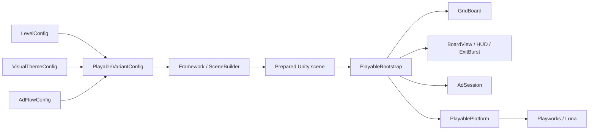

# Color Block Playable Framework

A Color Block Jam-inspired playable ad built with Unity and Playworks. Levels, visuals, and ad flow are configured through ScriptableObjects and prepared with a single editor tool.

I built this as a portfolio project, with most of the scene setup done in the editor. The runtime handles input, grid rules, animation, and the ad session. Blocks, meshes, UI, and effects are already in the scene when it starts.

<p align="center">
  
</p>

| | |
| --- | --- |
| Unity | `6000.0.72f1` |
| Playworks / Luna SDK | `7.2.0` |
| Gameplay | Drag blocks to matching exits |
| Rendering | Orthographic camera, flat meshes, vertex colors |
| Level setup | ScriptableObjects and an editor window |
| Stress level | 16 × 20 grid, 80 blocks, 8 colors, 8 exits |
| Effects | 12 reusable mesh fragments |

## Contents

- [Setup](#setup)
- [Designing levels](#designing-levels)
- [Level examples](#level-examples)
- [Architecture](#architecture)
- [Visuals](#visuals)
- [Ad flow](#ad-flow)
- [Responsive UI](#responsive-ui)
- [Optimization](#optimization)
- [Performance and build size](#performance-and-build-size)
- [Tests](#tests)
- [Extending the project](#extending-the-project)
- [Project structure](#project-structure)
- [Troubleshooting](#troubleshooting)

## Setup

1. Open the project in Unity **6000.0.72f1**.
2. Download and extract the Playworks **7.2.0** SDK to a permanent location outside the project.
3. Open **Tools → Color Block → Framework**.
4. Click **Connect Playworks SDK…** and select **`scripts/package.json`** inside the extracted SDK. The SDK root should also contain `pipeline` and `tools`.
5. Let Unity resolve the package and compile, then sign in to Playworks.
6. Select a config in **Active Variant**.
7. Click **Validate variant**, then **Prepare playable scene**.
8. Open `Assets/_Project/Scenes/Playable_2D.unity` and enter Play Mode.

The editor synchronizes the `PLAYWORKS_SDK` scripting define when it detects the SDK. Without it, the game can still be previewed in Unity; store clicks are logged instead of opening a store. Release builds require the SDK.

If you move the SDK folder or open the project on another machine, reconnect it through the Framework window.

## Designing levels

### Configs

Each variant references three configs:

| Asset | Contents |
| --- | --- |
| `LevelConfig` | Grid dimensions, cell overrides, block shapes, positions, and exits |
| `VisualThemeConfig` | Palette, board and frame colors, gaps, corner radius, studs, and material |
| `AdFlowConfig` | Text, tutorial, CTA behavior, interaction timing, and end conditions |
| `PlayableVariantConfig` | References to the above, plus movement speed and exit duration |

The included variants are:

| Variant | Level |
| --- | --- |
| `Variant_A` / `Variant_B` | Starter level with different ad flows |
| `Variant_Showcase` | 8 × 10 grid, 20 blocks, 4 bottom exits |
| `Variant_Stress` | 16 × 20 grid, 80 blocks, 8 bottom exits |
| `Variant_Heart` | Heart silhouette, 12 blocks, exits on all four sides |
| `Variant_Shapes` | L, T, zigzag, bar, and single-cell blocks around a central obstacle |
| `Variant_OneWay` | Four one-way lanes, a locked block, and an eight-block clear target |

The prepared scene uses `Variant_Stress`. One variant is prepared for each build; levels are not loaded in sequence at runtime.

### Editor controls

Open **Tools → Color Block → Framework**.

| Control | Action |
| --- | --- |
| **Active Variant** | Select the variant to edit and prepare |
| **Selected Block** | Choose the block to move on the grid |
| Click or drag on the grid | Set the selected block's origin |
| **Shift + click** | Add an obstacle override, or remove an existing cell override |
| **Level / shapes / gates** | Edit block lists, shape cells, colors, and exits |
| **Theme / palette** | Edit visual settings |
| **Ad flow** | Edit text, timing, and session behavior |
| **Validate variant** | Check the configuration for errors |
| **Prepare playable scene** | Generate and save the scene |

The window combines a grid preview with the config Inspectors. Positions can be edited on the grid; new blocks, shape cells, and exits are added through their lists.

### Creating a variant

1. Create a level through **Create → Playable → Data → Level Config**, or duplicate `Level_Starter` / `Level_Showcase`.
2. Create a variant through **Create → Playable → Data → Variant Config**, or duplicate an existing variant.
3. Assign the level, theme, and ad flow.
4. Set a `variantId`.
5. Edit the board, blocks, and exits.
6. Select the variant in the Framework window, validate it, and prepare the scene.

Duplicating a variant keeps its existing config references. Duplicate the level, theme, or flow as well if you want to edit it independently. Shared configs are useful when several creatives should use the same palette or ad behavior.

### Grid and shapes

The bottom-left cell is `(0, 0)`. X increases to the right and Y increases upward. Grid dimensions range from 1 to 64 cells per axis.

A block has an `origin` on the board and a list of `localCells` describing its shape. For example:

```text
id: red_square
colorId: Red
origin: (0, 0)
localCells: [(0, 0), (1, 0), (0, 1), (1, 1)]
movementMode: Free
```

That creates a 2 × 2 block. An L shape could use `[(0, 0), (1, 0), (0, 1)]`.

Shapes must be connected and cannot contain duplicate cells. Blocks cannot overlap, leave the board, or occupy blocked or inactive cells.

An empty `cells` list creates a fully active rectangular board. Add entries only for exceptions: `isBlocker` marks an obstacle, and `isActive = false` disables a cell. For shaped boards, the editor builds the floor and frame around the active cells. Exits still sit on the outer edges of the grid rectangle.

Movement modes:

- `Free`
- `HorizontalOnly` / `VerticalOnly`
- `UpOnly` / `DownOnly` / `LeftOnly` / `RightOnly`
- `Locked`

Movement is resolved as horizontal or vertical grid steps, including for `Free` blocks.

### Exits

Each exit has a unique `id`, a `colorId`, a `side`, a `startIndex`, and a `length`.

| Side | Index direction |
| --- | --- |
| `Top` / `Bottom` | X, from left to right |
| `Left` / `Right` | Y, from bottom to top |

A bottom exit for the red square above would use `side = Bottom`, `startIndex = 0`, `length = 2`, and `colorId = Red`.

The block must match the exit's color and fit completely through a single opening. Adjacent exits do not combine into a wider opening. Exits on the same edge cannot overlap.

Blocks and exits use the eight gameplay colors. `Slate` and `Navy` are additional palette IDs for surfaces such as the board and frame.

### Preparing the scene

**Prepare playable scene** validates the selected variant and creates:

- A combined mesh for the floor, walls, and exits.
- Persistent shape meshes, shared by blocks with matching geometry.
- Block objects and their color references.
- The camera, HUD, background, selection outline, and fragment pool.

It then saves the scene and selects it for the build.

Rebuilds replace the generated board, camera, and HUD. Independent objects added under the bootstrap are preserved. Changes to generated content should go through the configs or builders so they survive the next rebuild.

Run **Prepare playable scene** again after changing a level, shape, theme, or active variant. Editing a config alone does not rebuild the saved geometry.

Validation checks configuration errors. The 80-block level also has a solution test; arbitrary custom levels still need a playthrough.

## Level examples

These three levels use the same runtime as the 80-block stress scene. Each has its own level, theme, and flow config. Select its variant in **Tools → Color Block → Framework**, then click **Prepare playable scene** to try it.

### Heart Board

<p align="center">
  
</p>

[`Variant_Heart`](Assets/_Project/Configs/Variant_Heart.asset) uses inactive cells to cut a heart out of a 10 × 10 grid. The floor and pink frame follow that silhouette, including the notch between the two lobes. Twelve blocks share seven exits across all four sides; clearing the two central red blocks opens a route for the red blocks on either side.

This is an example of changing the board silhouette without adding a new movement rule. The frame is baked into the board mesh when the scene is prepared. All twelve blocks must leave to finish the level.

### Shape Lab

<p align="center">
  
</p>

[`Variant_Shapes`](Assets/_Project/Configs/Variant_Shapes.asset) combines L, T, and zigzag blocks with horizontal and vertical bars and a single-cell block. Four obstacle cells sit in the center. The eight exits have different widths, so each complete shape must fit its opening.

Shapes come from `localCells`; they use the same occupancy checks, dragging, highlights, and exit animation as square blocks. Clear all eight to win. This layout is deliberately open so the different shapes and exits are easy to try.

### One-Way Lanes

<p align="center">
  
</p>

[`Variant_OneWay`](Assets/_Project/Configs/Variant_OneWay.asset) gives each color one direction: red moves right, blue down, yellow left, and green up. The outer block in each pair clears before the inner block can follow. A ring of obstacles surrounds a permanently locked purple block.

The flow uses `OnTargetBlocksCleared` with a target of eight. The level ends when the movable blocks are gone; the purple block stays on the board. This combines movement restrictions, obstacles, and a partial-clear goal through config data.

The examples use completion goals to show those flow options. The stress creative keeps its existing ten-second active-interaction store flow. Preparing one example exports that variant and its referenced assets; the other examples and these documentation images are not bundled into it.

## Architecture



| Class | Responsibility |
| --- | --- |
| [`GridBoard`](Assets/_Project/Scripts/Runtime/Core/GridBoard.cs) | Occupancy, shapes, movement constraints, and exit rules |
| [`PlayableBootstrap`](Assets/_Project/Scripts/Runtime/PlayableBootstrap.cs) | Input and coordination of movement, hints, effects, camera, and ad flow |
| [`BoardView`](Assets/_Project/Scripts/Runtime/View/BoardView.cs) | Prepared transforms, colors, movement queue, and selection visuals |
| [`ExitBurst`](Assets/_Project/Scripts/Runtime/View/ExitBurst.cs) | Fragment movement, rotation, scaling, and reuse |
| [`PlayableHud`](Assets/_Project/Scripts/Runtime/View/PlayableHud.cs) | Text, CTA, safe-area layout, and UI animation |
| [`AdSession`](Assets/_Project/Scripts/Runtime/Flow/AdSession.cs) | Moves, elapsed time, interaction time, and end conditions |
| [`PlayablePlatform`](Assets/_Project/Scripts/Runtime/Platform/PlayablePlatform.cs) | Analytics, pause/resume, and store calls |
| [`PlayableSceneBuilder`](Assets/_Project/Scripts/Editor/PlayableSceneBuilder.cs) | Config-to-scene preparation |
| [`FlatMeshBuilder`](Assets/_Project/Scripts/Editor/FlatMeshBuilder.cs) | Geometry generation and compaction in the editor |

### Grid model

`GridBoard` copies the level data at startup. Moving a block updates runtime state without modifying the source ScriptableObject.

A step is checked before occupancy changes. Rejected steps leave the board untouched; accepted steps update the old and new cells. `PreviewStep` runs the same checks without applying the move, which lets the hint system use the actual movement rules.

The model has no MonoBehaviour or physics dependency. Visuals follow its results with interpolation, so animation timing does not decide whether a move is valid.

### Dependencies

I kept dependencies as direct scene references and small runtime classes. The current setup does not need a DI container, a general event bus, or a separate Update loop on each block. Configs, the grid model, and the platform adapter provide the main extension points.

## Visuals

The board uses flat meshes in front of an orthographic camera. Small Z offsets separate the layers. Rounded silhouettes and baked color differences give the pieces their depth.

| Detail | Implementation |
| --- | --- |
| Rounded blocks | Corner geometry |
| Thick edges | Bright top edges and darker sides/undersides |
| Studs | Layered colored discs |
| Board frame | Shaded faces and a darker lower layer |
| Outer corners | Separate rounded corner sections |
| Floor | Spaced cell surfaces over a darker base |
| Selection outline | A slightly enlarged copy of the selected block's shared mesh |
| Pickup | Smooth scale increase on the selected block |

Board and block surfaces use vertex colors rather than texture assets. Their shading needs no real-time lights or shadow maps.

### Shared shapes and colors

Shape meshes are generated with white shading. Each renderer applies its palette tint, allowing different-colored blocks to share the same mesh.

Board and frame colors are selected through `ColorId` fields. The actual shades live in `VisualThemeConfig`.

During development, reusing a mutable `MaterialPropertyBlock` caused blocks to take the last assigned color in Playworks. Each block now gets its own property block. The tint is converted explicitly and sent through `SetVector("_Color", ...)` to keep Unity and Playworks color handling consistent.

Blocks share a material and geometry, while renderer color overrides and batching limits determine the final draw count.

### Background

[`MovingWater.shader`](Assets/_Project/Shaders/MovingWater.shader) animates a small **91-vertex / 144-triangle** mesh using `_Time`. Wave calculations run in the vertex shader; the fragment shader returns the interpolated color.

This keeps the moving background to one mesh and a shader, without a video, texture sequence, or per-frame C# mesh generation.

### UI

The CTA background is drawn by [`RoundedButtonGraphic`](Assets/_Project/Scripts/Runtime/View/RoundedButtonGraphic.cs): a rounded face, dark border, and lower shadow using **51 vertices / 48 triangles**.

CTA and tutorial text use **Lilita One** with white fill and a dark outline. The header and supporting labels use Unity's **LegacyRuntime** font. The current tutorial copy is **“Tap and clear the board!”**

The button pulse, text entrance, pickup, and release animations use simple time and interpolation calculations.

### Exit fragments

The exit effect uses **12 prepared mesh fragments**. Each shares the same small shape; one class updates their position, rotation, and scale. Renderers are enabled for the burst and disabled when it finishes. The current effect lasts about 0.6 seconds.

<p align="center">
  
</p>

The pool avoids runtime object creation and physics simulation. Only one exit effect runs at a time.

## Ad flow

The showcase and stress variants use this flow:

1. Show the hook, board, and CTA.
2. Display the tutorial after a short delay.
3. Highlight and slightly enlarge a held block. Interpolate its position as grid steps are accepted.
4. Hide an escaped block and play the fragment burst.
5. After an idle period, briefly highlight a block with a valid move.
6. Keep the CTA available throughout the session.
7. After **10 seconds of active block interaction**, let the next new screen press open the store as well.

Interaction time counts while a valid block is held or dragged. Waiting, pressing empty space, and paused time do not count. Reaching the threshold arms the next press; it does not interrupt the current drag with an automatic store redirect.

The current flow uses `Manual`, with no score target or automatic win card. Other configs can end on all blocks cleared, a target clear count, a timer, or a move limit.

### Analytics

SDK calls are kept in `PlayablePlatform`.

| Event | Trigger |
| --- | --- |
| `TutorialStarted` | Session start when the tutorial is enabled |
| `FirstMoveCompleted` | Release of the first gesture containing a valid move |
| `CtaClicked` | CTA press or store press after the interaction threshold |
| `PlayerWon` / `PlayerLost` | Session completion through an end condition |
| SDK level/end-card events | The corresponding completion or end-card flow |

Win/loss events belong to the completion flows; the manual showcase does not emit them automatically.

`LunaPlaygroundField` exposes the interaction threshold, hook, tutorial, CTA, and end-card title. New text or language variants need the relevant characters in the exported font atlas.

## Responsive UI

The Canvas scales from a `1080 × 1920` reference resolution. The white header background reaches the top edge, while the text sits inside the protected content area. The CTA anchors to its bottom edge, and the camera uses the same area for board framing.

Playworks 7.2.0 returns the full viewport from `Screen.safeArea`, including the preview's notch overlay. I added a fallback in `PlayableHud.GetSafeArea` after the header was clipped in the iPhone preview.

| Orientation | Top | Sides | Bottom |
| --- | ---: | ---: | ---: |
| Portrait | 6.5% | 2% | 4% |
| Landscape | 2% | 6% | 4% |

The fallback adds minimum layout margins and preserves larger insets when the device reports them. Layout is recalculated at startup and when the viewport or safe area changes.

<p align="center">
  
</p>

## Optimization

Most of the savings came from preparing content ahead of time and reducing repeated work.

| Change | Reason |
| --- | --- |
| Prepare the board, blocks, camera, and HUD in the editor | Remove scene construction from startup |
| Cache and share shape meshes | Store repeated geometry once |
| Combine the floor, walls, and exits | Reduce environment renderer count |
| Store vertex colors as `Color32` | Use 4 bytes per color instead of 16 |
| Weld matching position/color vertices | Remove duplicate vertex data while retaining color boundaries |
| Remove zero-area triangles | Drop geometry that contributes no visible surface |
| Queue moving blocks | Avoid position writes to idle blocks |
| Reuse the selection renderer and fragment pool | Avoid Instantiate/Destroy during interaction |
| Resolve collisions through grid occupancy | Keep Rigidbody and Collider simulation out of gameplay |
| Tick animations centrally | Avoid per-block Update loops and Animator components |
| Remove the unused skybox and reflection content | Stop exporting the default cubemap |
| Exclude authoring helpers from player compilation | Keep editor-only validation out of the runtime |

Startup still allocates the model arrays, movement queue, and property blocks. The reuse applies to gameplay objects and effects after that setup.

### Geometry results

For the 80-block level:

| Metric | Before compaction | After | Reduction |
| --- | ---: | ---: | ---: |
| Shared block mesh | 596 vertices | 298 vertices | 50% |
| Visible board and blocks | 54,386 vertices | 30,298 vertices | 44.3% |
| Visible triangles | 41,784 | 29,032 | 30.5% |

These counts exclude UI and hidden fragments. A comparison of **257,640 board pixels** before and after compaction had **zero RGB difference**.

## Performance and build size

### Playworks preview


Recorded with the 80-block level:

| Metric | Result |
| --- | --- |
| CPU | 12% in the captured frame |
| Average frame time | Approximately 2 ms in the panel |
| RAM | 90–130 MB during play; peaks near 130 MB are rare |
| RAM around the CTA press | Approximately 96 MB |
| Memory over time | Fluctuates without a sustained upward trend |
| Draw calls | 16 |
| Vertices / triangles | 30,886 / 29,596 |
| Material switches / shadow casters | 3 / 0 |

### Build size

Use **Size Breakdown → Build & Estimate size** in Playworks for an asset breakdown. Check **Download / Publish** for the final ad-network export.


| Output | Recorded size |
| --- | --- |
| ironSource export estimate | 671.18 KB |
| ironSource scripts | 432.79 KB |
| ironSource fonts | 63.96 KB |
| ironSource meshes | 22.96 KB |
| Local Playground ZIP | 1,458,376 bytes, approximately 1.39 MiB |

The ironSource estimate and Playground ZIP are separate export targets. Their packaging, SDK code, and compression differ.

The asset export contains **4 ScriptableObjects, 4 meshes, 2 fonts, and no cubemap**. It includes the selected variant and its dependencies. Board surfaces have no source textures; the SDK generates atlases for the fonts.

## Tests

### Grid rules

```sh
sh Tests/run_core_tests.sh
```

The script uses Mono and Unity's managed assemblies. Its default paths match Unity 6000.0.72f1 on macOS. Set `UNITY_MANAGED_PATH`, `MONO_BIN`, and `UNITY_FACADE_PATH` for another installation.

The 14 test groups cover occupancy updates, rejected moves, cardinal movement, multi-cell shapes, read-only previews, all four exit directions, color and opening checks, obstacles, movement modes, copied level data, and irregular shapes. Another **5,000 random moves** check occupancy consistency.

### Scene and runtime checks

[`PlayableSceneBuilder.VerifyProject`](Assets/_Project/Scripts/Editor/PlayableSceneBuilder.cs) checks configs, scene rebuilds, persistent shared meshes, Color32 storage, HUD references, and shader imports. It prepares the default stress variant.

Batch helpers live outside `Assets`. Copy them into an isolated project's `Assets/_Project/Scripts/Editor` folder and call their static `Run` methods in Unity batch mode.

| Helper | Checks |
| --- | --- |
| [`LevelExamplesChecks`](Tests/LevelExamplesChecks.cs) | Solves all three example levels, checks one-way and locked movement, verifies win conditions, renders previews, and restores the stress scene |
| [`StressSceneChecks`](Tests/StressSceneChecks.cs) | Solves all 80 blocks; checks mesh sharing, movement queues, repeated targets, and allocations |
| [`BurstVisibilityChecks`](Tests/BurstVisibilityChecks.cs) | Checks prepared renderers, fragment size, lifetime, and cleanup |
| [`ResponsiveLayoutChecks`](Tests/ResponsiveLayoutChecks.cs) | Checks five screen/orientation sizes, full-viewport safe-area fallback, larger reported insets, and title/CTA bounds |

Managed allocations measured in Unity after initialization and warm-up:

| Loop | Allocation |
| --- | ---: |
| 10,000 idle movement ticks | 0 bytes |
| 10,000 move/hint previews | 0 bytes |
| 1,000 ticks with all 80 blocks moving | 0 bytes |

These measurements cover the listed Unity calls on the measured thread. Browser allocations are separate.

The full Playworks build passes compilation, the health report is empty, and ZIP integrity checks pass. Before exporting a new creative, check colors, exits, effects, orientation changes, pause/resume, and store clicks.

Detailed measurements: [`Tests/StressAudit.md`](Tests/StressAudit.md).

## Extending the project

| Change | Start here |
| --- | --- |
| New board or block shapes | `LevelConfig` |
| New palette or surface style | `VisualThemeConfig` and the editor mesh builders |
| New text, timing, or end condition | `AdFlowConfig` and `AdSession` |
| New movement or exit rule | `GridBoard`, its core tests, then the view |
| New visual effect | Prepared scene objects and the central tick flow |
| New SDK event | `PlayablePlatform` |
| Better level editing controls | `PlayableFrameworkWindow` |

The current scope covers grid movement and color exits. Automatic puzzle generation, a general solver, runtime level streaming, and lock/key/chain mechanics are not implemented.

## Project structure

```text
Assets/_Project/
├── Configs/                 Levels, themes, flows, and variants
├── Fonts/                   Lilita One and its OFL license
├── Generated/Meshes/        Persistent geometry created in the editor
├── Materials/               Shared vertex-color and water materials
├── Scenes/                  Prepared playable scene
├── Scripts/
│   ├── Data/                Configs and data types
│   ├── Editor/              Framework window, builders, and validation
│   └── Runtime/             Grid model, flow, views, and SDK adapter
└── Shaders/                 Vertex-color shading and moving water
Tests/                      Core tests, batch checks, and audit notes
docs/images/                README screenshots
Builds/Stress/              Local export packages, ignored by Git
```

Documentation images and test helpers stay outside `Assets`, so they are not imported into the playable. Local build packages are ignored by Git; the README screenshots are tracked separately.

## Troubleshooting

| Issue | Check |
| --- | --- |
| SDK `package.json` is missing | Reconnect the extracted SDK's `scripts/package.json` through the Framework window |
| The scene still shows the old level | Select the right variant and run **Prepare playable scene** |
| Editing one variant changes another | Check for shared config references; duplicate the config if it should be independent |
| A block will not exit | Check the color, side, span, and whether the whole shape fits one opening |
| Validation fails | Check IDs, connected shapes, overlap, cell overrides, and gate spans |
| Blocks have the same color in the build | Keep separate property blocks and explicit color conversion; prepare and export again |
| The header is under the notch | Check that the current safe-area code and prepared HUD are in the exported creative |
| Exit fragments are missing | Check the prepared 12-renderer pool and test the latest export |
| RAM keeps increasing | Capture a browser heap profile and inspect retained allocations |

## References and credits

- [Playworks: Asset Size Breakdown](https://docs.lunalabs.io/docs/playable/optimise-your-builds/asset-size-breakdown/)
- [Playworks: Performance Indicator](https://docs.lunalabs.io/docs/playable/optimise-your-builds/performance-indicator/)
- [Playworks: JavaScript Profiler](https://docs.lunalabs.io/docs/playable/code/plugin-in-browser/profiler-js/)
- [Playworks: UI cropped off screen](https://docs.lunalabs.io/docs/playable/common-issues/ui/ui-cropped-off/)
- [Lilita One license — SIL OFL 1.1](Assets/_Project/Fonts/OFL.txt)

Lilita One was designed by Juan Montoreano. Its license is included with the font.

Independent portfolio project inspired by Color Block Jam. Not affiliated with Rollic or Playable Factory. Board and block visuals are generated by the project's mesh builders.
